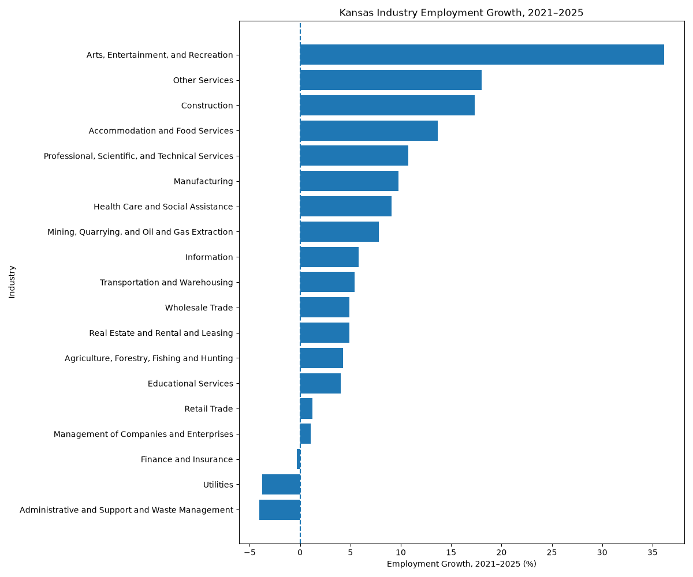
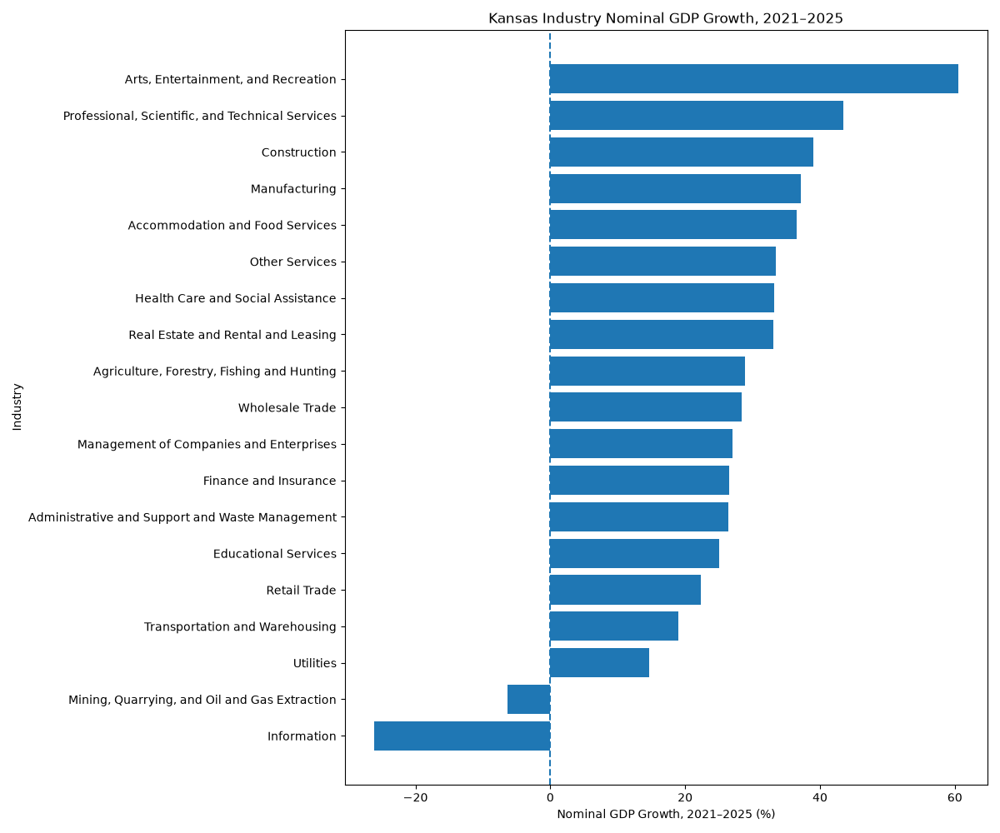
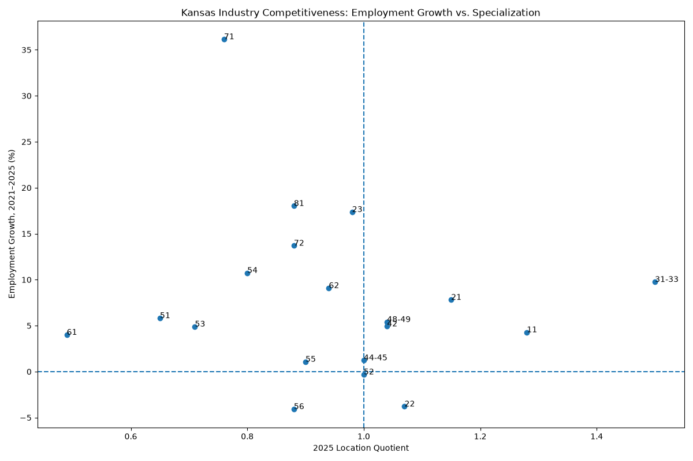
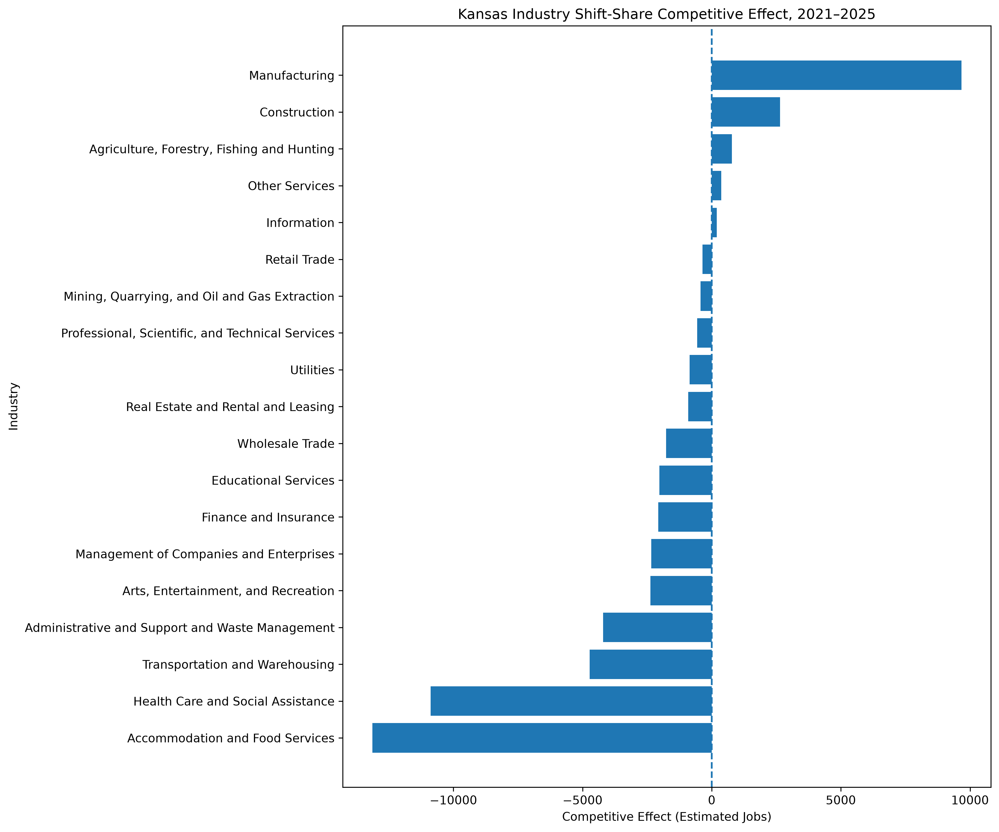

# Kansas Industry Growth and Economic Competitiveness Analysis

## Overview

This project evaluates industry growth and economic competitiveness across Kansas from 2021 to 2025.

The analysis combines labor-market data from the U.S. Bureau of Labor Statistics (BLS) with industry GDP data from the U.S. Bureau of Economic Analysis (BEA).

The project examines:

- Employment growth
- Average weekly wages
- Wage growth
- Location Quotient
- Nominal GDP growth
- U.S. industry benchmarks
- Shift-share analysis
- Competitive effects

## Research Question

Which Kansas industries are growing, declining, becoming more economically concentrated, and showing potential competitive advantages?

## Data Sources

### U.S. Bureau of Labor Statistics

Quarterly Census of Employment and Wages (QCEW)

Used for:

- Industry employment
- Average weekly wages
- Year-over-year growth
- Location Quotient
- U.S. industry benchmarks

### U.S. Bureau of Economic Analysis

Regional GDP by Industry

Used for:

- Kansas industry GDP
- 2021–2025 nominal GDP growth

## Analysis Period

2021–2025

## Key Findings

### Growing and Specialized Industries

Four industries showed both employment growth and a 2025 Location Quotient above 1.0:

- Manufacturing
- Transportation and Warehousing
- Wholesale Trade
- Agriculture, Forestry, Fishing and Hunting

Manufacturing showed:

- Approximately 9.8% employment growth
- Approximately 37.2% nominal GDP growth
- 2025 Location Quotient of 1.50

### Shift-Share Analysis

Shift-share analysis separated Kansas employment change into:

1. National Growth Effect
2. Industry Mix Effect
3. Competitive Effect

Manufacturing showed the strongest positive competitive effect, at approximately 9,665 jobs.

Construction and Agriculture also showed positive competitive effects.

Some Kansas industries increased employment but grew more slowly than their national counterparts, producing negative competitive effects.

## Visual Results

### Employment Growth by Industry


### GDP Growth by Industry


### Growth vs. Location Quotient


### Shift-Share Competitive Effect



## Tools & Technologies

- Python
- pandas
- NumPy
- Matplotlib
- Requests
- python-dotenv
- BLS QCEW API
- BEA Regional API
- Git & GitHub


## Project Structure

```text
Kansas Industry Growth and Economic Competitiveness Analysis
│
├── data
│   ├── raw
│   └── processed
│
├── scripts
├── notebooks
├── sql
├── outputs
├── dashboard
├── reports
└── README.md

